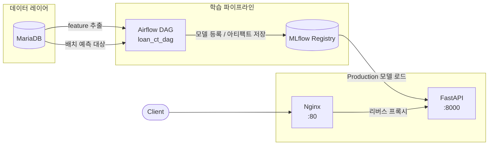

# 신용대출 부적격 예측 MLOps 파이프라인

신용대출 신청자의 데이터를 기반으로 **대출 부적격 여부를 예측**하는 엔드투엔드 MLOps 시스템입니다.  
Logistic Regression 모델을 Airflow로 학습·배포하고, FastAPI로 실시간 추론을 제공합니다.

---

## 아키텍처



### 데이터 흐름

| 단계 | 흐름 |
|------|------|
| **학습** | Airflow → MariaDB(`mlops.ineligible_loan_model_features_target`) → 전처리 → 학습 → MLflow 등록 |
| **배치 예측** | Airflow → MariaDB(`mlops.ineligible_loan_model_features`) → 변환 → 예측 → 결과 저장 |
| **실시간 추론** | `POST /predict` → 전처리 → 모델 추론 → 응답 |

---

## 기술 스택

| 역할 | 기술 |
|------|------|
| 오케스트레이션 | Apache Airflow 2.x |
| 실험 추적 / 모델 레지스트리 | MLflow |
| API 서버 | FastAPI + Uvicorn |
| 리버스 프록시 | Nginx |
| 데이터베이스 | MariaDB 10.6 |
| ML | scikit-learn (LogisticRegression, OneHotEncoder, StandardScaler, MinMaxScaler) |
| 컨테이너 | Docker / Docker Compose |
| 언어 | Python 3.11 |

---

## 실행 방법

### 1. 환경 변수 설정

```bash
cp .env.example .env
```

`.env`에서 아래 값을 채웁니다.

```bash
# Airflow Fernet 키 생성
python -c "from cryptography.fernet import Fernet; print(Fernet.generate_key().decode())"
```

### 2. 전체 스택 시작

```bash
docker-compose up -d
```

### 3. 특정 서비스만 시작

```bash
docker-compose up -d api mlflow mariadb
```

### 4. 코드 변경 후 재빌드

```bash
docker-compose build api
docker-compose up -d api
```

### 서비스 엔드포인트

| 서비스 | URL |
|--------|-----|
| API (Nginx 경유) | http://localhost:80 |
| API (직접) | http://localhost:8000 |
| MLflow UI | http://localhost:5001 |
| Airflow UI | http://localhost:8080 |
| MariaDB | localhost:3307 |

---

## API 명세

### `POST /predict` — 실시간 단건 예측

**Request Body**

```json
{
  "applicant_id": "LP001002",
  "gender": "Male",
  "married": "Yes",
  "family_dependents": "0",
  "education": "Graduate",
  "self_employed": "No",
  "applicant_income": 5000,
  "coapplicant_income": 0,
  "loan_amount_term": 360,
  "credit_history": 1.0,
  "property_area": "Urban"
}
```

| 필드 | 타입 | 허용값 |
|------|------|--------|
| `applicant_id` | string | 임의 식별자 |
| `gender` | string | `"Male"`, `"Female"` |
| `married` | string | `"Yes"`, `"No"` |
| `family_dependents` | string | `"0"`, `"1"`, `"2"`, `"3+"` |
| `education` | string | `"Graduate"`, `"Not Graduate"` |
| `self_employed` | string | `"Yes"`, `"No"` |
| `applicant_income` | int | > 0 |
| `coapplicant_income` | int | >= 0 |
| `loan_amount_term` | int | > 0 (개월) |
| `credit_history` | float | 0.0 또는 1.0 |
| `property_area` | string | `"Rural"`, `"Semiurban"`, `"Urban"` |

**Response**

```json
{
  "applicant_id": "LP001002",
  "predict": 0,
  "probability": 0.1234,
  "model_version": "3"
}
```

| 필드 | 설명 |
|------|------|
| `predict` | `1` = 대출 부적격(Default), `0` = 신용양호(Creditworthy) |
| `probability` | 부적격 확률 (0.0 ~ 1.0) |
| `model_version` | MLflow Registry의 Production 모델 버전 |

---

### `POST /predict/batch` — 배치 예측

Request Body: `LoanApplicantRequest` 배열  
Response: `PredictResponse` 배열

---

### `GET /health` — 헬스체크

```json
{ "status": "ok" }
```

---

### `GET /model/info` — 현재 로드된 모델 정보

```json
{
  "model_name": "ineligible_loan_model",
  "model_stage": "Production",
  "model_version": "3"
}
```

---

## 모델 프로모션 기준

`evaluation.is_promotable()`이 아래 조건을 모두 만족할 때만 MLflow Registry의 Production으로 승격됩니다.

| 지표 | 기준 |
|------|------|
| Test Accuracy | >= 0.80 |
| Cumulative Lift @10% | >= 1.5 |

---

## 트러블슈팅

개발 중 발생한 이슈와 해결 방법은 [TROUBLESHOOTING.md](./TROUBLESHOOTING.md)를 참조하세요.

---

## 개발 방식

- Claude Code(AI 코딩 에이전트)를 활용한 AI-assisted 개발 워크플로우 적용
- 코드 생성 후 직접 코드 리뷰 및 구조 이해
- Phase 3 통합 테스트 중 발생한 7개 트러블슈팅 직접 해결
- 에이전트 활용 능력과 코드 이해력을 함께 키우는 방식으로 진행
